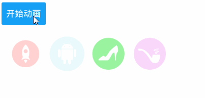
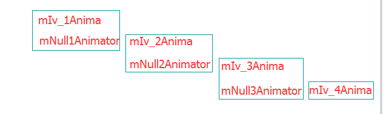

# AnimatorSet
使用AnimatorSet控制动画执行顺序

先看下动画的效果



第一张控件动画开始800毫秒之后，第二个控件就开始动画，

第二个控件动画开始800毫秒之后下一个控件动画开始，依次类推

1.首先来看下我实现这个动画需要的对象
```python
//这是4个控件，我用的TextView
private TextView iv_1;
private TextView iv_2 ;
private TextView iv_3 ;
private TextView iv_4 ;
//这是4个控件的动画对象，每个动画都是一样的，等下贴出代码
private ValueAnimator mIv_1Anima ;
private ValueAnimator mIv_2Anima ;
private ValueAnimator mIv_3Anima ;
private ValueAnimator mIv_4Anima ;
//这是3个空的动画，主要是控制800毫秒的动画间隔时间的，等下贴出代码
private ValueAnimator mNull1Animator ;
private ValueAnimator mNull2Animator ;
private ValueAnimator mNull3Animator ;
private AnimatorSet mAnimatorSet;
private boolean isAnimationRun;//记录动画是否在运行
```
2.动画的代码

```python
//控件动画都是一样的
mIv_1Anima = ValueAnimator. ofFloat( 1.3f, 0.8f , 1.0f ) ;
mIv_1Anima .setInterpolator( new LinearInterpolator()) ;
mIv_1Anima .addUpdateListener( new ValueAnimator.AnimatorUpdateListener() {
    @Override public void onAnimationUpdate (ValueAnimator animation) {
        iv_1 .setScaleX(( float) animation.getAnimatedValue());
        iv_1 .setScaleY(( float) animation.getAnimatedValue());
        iv_1 .setAlpha(animation.getAnimatedFraction()) ;
    }
});
mIv_1Anima .setDuration( 2000) ;
```
```python
//控制间隔时间的动画
mNull1Animator = ValueAnimator.ofFloat (1.0F , 0F );
mNull1Animator .setDuration(800 ) ;
```

3.先来讲解下AnimatorSet的几个控制动画顺序的函数
play(Animator anima)     -->    设置一个参考动画anima

with(Animator anima)     -->    跟参考动画同时执行anima

before(Animator anima)   -->    在参考动画之前执行anima

after(Animator anima)    -->    在参考动画之后执行anima

after(long delay)        -->    在参考动画之后延迟delay毫秒，才执行参考动画之后的动画

4.控制动画执行顺序

  个人感觉AnimatorSet是根据 **两点一线** 原则来控制动画执行顺序的位置的
  
```python
//mIv_1Anima与mNull1Animator一起执行
mAnimatorSet .play(mIv_1Anima ).with( mNull1Animator) ;
//mIv_2Anima 在 mNull1Animator 之前执行
mAnimatorSet .play(mNull1Animator ).before( mIv_2Anima) ;
// mNull2Animator 在 mNull1Animator之前执行
mAnimatorSet .play(mNull1Animator ).before( mNull2Animator) ;
// mNull2Animator 与 mIv_2Anima一起执行
mAnimatorSet .play(mNull2Animator ).with( mIv_2Anima) ;
// mIv_3Anima 在 mNull2Animator 之前执行
mAnimatorSet .play(mNull2Animator ).before( mIv_3Anima) ;
// mNull3Animator 在 mNull2Animator 之前执行
mAnimatorSet .play(mNull2Animator ).before( mNull3Animator) ;
//mNull3Animator 与 mNull3Animator 一起执行
mAnimatorSet .play(mNull3Animator ).with( mIv_3Anima) ;
// mIv_4Anima 在 mNull3Animator 之前执行
mAnimatorSet .play(mNull3Animator ).before( mIv_4Anima) ;
```

//看到这长篇的代码是不是感觉头有点晕，反正我是有点晕，那么我们就根据这个代码画个简单的图来加深下理解吧



在同一个框中的动画是同时执行的，根据代码对比图片，个人感觉还是容易理解些。

5.开始动画

```python
  mAnimatorSet.addListener(new AnimatorListenerAdapter() {
            @Override
            public void onAnimationStart(Animator animation) {
                isAnimationRun = true;
            }

            @Override
            public void onAnimationEnd(Animator animation) {
                isAnimationRun = false;
            }

            @Override
            public void onAnimationCancel(Animator animation) {
                isAnimationRun = false;
            }
  });
  if (isAnimationRun) {
      mAnimatorSet.cancel();
  }
  mAnimatorSet.setStartDelay(500);
  mAnimatorSet.start();
```
